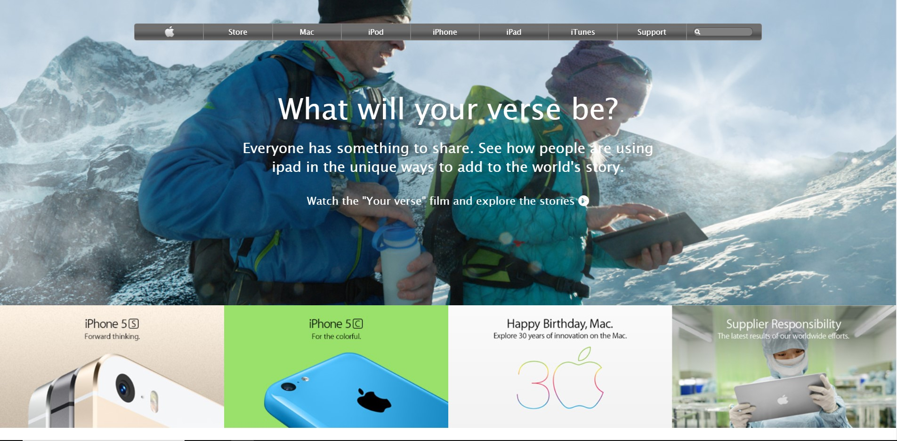

# Apple-Page

> This is a project for cloning an archived Apple page as a learning guide .

## Built With

- HTML
- CSS
- Flexbox
- Grid

## Live Demo

[Live Demo Link](https://raw.githack.com/janis-jenny/Apple-Homepage-clone-/Apple-homepage-branch/index.html)

## Authors

👤 **Jonathas Tavares**

- Github: [@jonathastavares](https://github.com/jonathastavares)
- Twitter: [@jhstavares](https://twitter.com/jhstavares)
- Linkedin: [linkedin](https://www.linkedin.com/in/jonathas-tavares-24b8bba3/)

👤 **Jenny Cardenas**

- Github: [@janis-jenny](https://github.com/janis-jenny)
- Twitter: [@janis_jenny](https://twitter.com/janis_jenny)
- Linkedin: [linkedin](https://www.linkedin.com/in/paolajenny)

## 🤝 Contributing

Contributions, issues and feature requests are welcome!

Feel free to check the [issues page](https://github.com/janis-jenny/Apple-Homepage-clone-/issues).

## Show your support

Give a ⭐️ if you like this project!

## 📝 License

This project is [MIT](lic.url) licensed.

